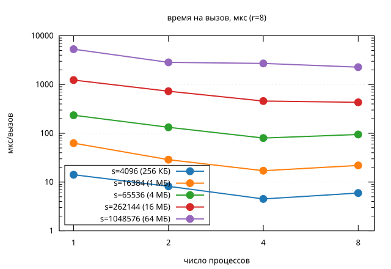
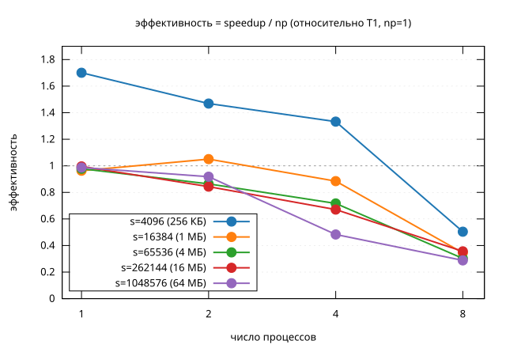

# Лаба 12

Вариант 1: вычисление значения многочлена блочной схемой q(x) = a0 + q1(x) + x^r*q2(x) + ... + x^((s-1)r)*qs(x), где qi(x) = a_k + ... + a_{k+r-1}x^(r-1), k=(i-1)r+1, всего s блоков по r коэффициентов (s это степень двойки).

## Алгоритм

Блоки q1(x), …, qs(x) это единица параллелизма. `block_range()` распределяет их по процессам блочным методом (с учётом остатка), а `scatter_coefficients()` через `MPI_Scatterv` рассылает каждому процессу только его коэффициенты, без репликации всего массива.

На своём диапазоне блоков процесс без обмена данными считает степени x^0…x^(r-1) один раз, вычисляет qi(x) как скалярное произведение блока на эти степени, домножает на множитель x^(i*r) (он обновляется инкрементально, а не через `pow` на каждый блок) и суммирует. Итог собирается через `MPI_Reduce`, а `a0` прибавляется на rank 0.

Код: `block_distribution.{hpp,cpp}` это распределение и рассылка, `polynomial_sequential.{hpp,cpp}` та же схема на одном процессе, `polynomial_parallel.{hpp,cpp}` MPI-версия.

## Методика измерений

`polynomial_benchmark <s> <r> <iterations>` рассылает коэффициенты один раз (вне замера), а затем `iterations` раз подряд гоняет sequential и parallel, деля суммарное `MPI_Wtime` на число вызовов. Sequential-версия измеряется отдельно, один раз при `np=1`, и этот результат (`T1`) используется как единый базис speedup/efficiency для всех `np`. Если мерить sequential заново внутри каждого `mpirun -np N`, простаивающие ранги конкурируют за память с rank 0, и время растёт вместе с `np` без всякой связи с самим алгоритмом.

Каждая точка это минимум из трёх повторов. Стенд: Intel Core i5-9300H (4 физических ядра, 8 потоков за счёт Hyper-Threading). Проверены размеры при r=8 от 256 КБ до 64 МБ на массив коэффициентов, np = 1, 2, 4, 8. Полные данные в `results.csv`.

| s | np | мкс/вызов | speedup | efficiency |
|---|---|---|---|---|
| 4096 | 1 | 14.1 | 1.70 | 1.70 |
| 4096 | 2 | 8.2 | 2.94 | 1.47 |
| 4096 | 4 | 4.5 | 5.33 | 1.33 |
| 4096 | 8 | 6.0 | 4.03 | 0.50 |
| 16384 | 1 | 62.9 | 0.96 | 0.96 |
| 16384 | 2 | 28.8 | 2.10 | 1.05 |
| 16384 | 4 | 17.1 | 3.54 | 0.88 |
| 16384 | 8 | 21.9 | 2.76 | 0.34 |
| 65536 | 1 | 234.6 | 0.98 | 0.98 |
| 65536 | 2 | 132.8 | 1.73 | 0.86 |
| 65536 | 4 | 80.0 | 2.87 | 0.72 |
| 65536 | 8 | 94.7 | 2.42 | 0.30 |
| 262144 | 1 | 1235.8 | 1.00 | 1.00 |
| 262144 | 2 | 729.5 | 1.69 | 0.84 |
| 262144 | 4 | 458.6 | 2.68 | 0.67 |
| 262144 | 8 | 431.7 | 2.85 | 0.36 |
| 1048576 | 1 | 5303.3 | 0.99 | 0.99 |
| 1048576 | 2 | 2851.2 | 1.84 | 0.92 |
| 1048576 | 4 | 2709.7 | 1.93 | 0.48 |
| 1048576 | 8 | 2272.9 | 2.30 | 0.29 |

## Выводы

Эффективность падает на `np=8` у всех размеров: на  всего 4 физических ядра, так что на `np=8` два процесса просто делят одно ядро, упираемся в ALU/FPU.

На `np=1,2,4` (реальные ядра) размеры ведут себя по-разному. У `s=65536` и `s=262144` эффективность падает плавно (для 262144: 1.00 при np=1, 0.84 при np=2, 0.67 при np=4), и это в основном фиксированная стоимость `MPI_Reduce` на фоне убывающего объёма работы на процесс. А у `s=1048576` (64 МБ, заведомо больше кэша) провал наступает раньше: уже на `np=4` эффективность всего 0.48 против 0.67 у 262144, потому что процессы на общих ядрах ещё и конкурируют за пропускную способность памяти.

`s=4096` тут не показателен: `efficiency=1.70` при `np=1` явно бессмысленна, вызов занимает единицы микросекунд, и на таком масштабе просто доминирует шум таймера, а не что-то реальное в коде.
